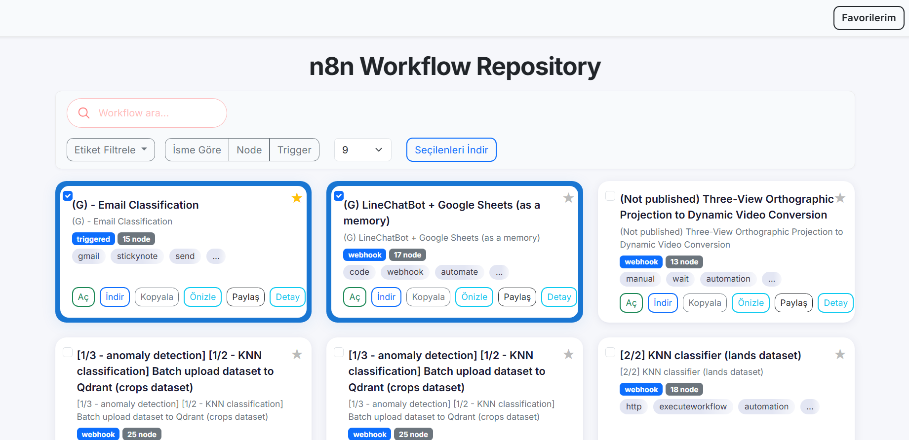
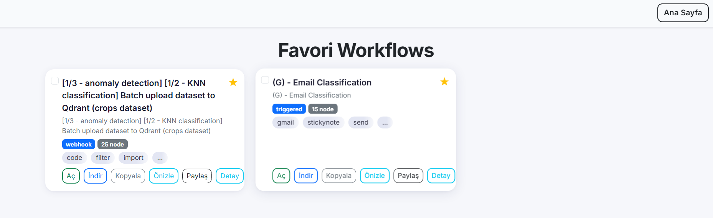
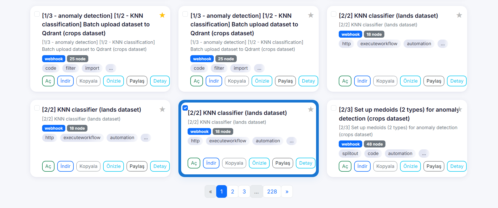

# n8n Workflow Repository

Bu proje, n8n için modern, arayüzü zengin ve kullanımı kolay bir workflow arşividir. Tüm arayüz ve kodlar **BUCKY** tarafından tasarlanmıştır.

## Özellikler

- **Modern ve Responsive Arayüz**: Tüm cihazlarda şık ve hızlı.
- **Gelişmiş Arama & Filtreleme**: Workflow'ları isim, etiket, node tipi ve trigger tipine göre filtreleyin.
- **Favorilere Ekleme**: Beğendiğiniz workflow'ları favorilerinize ekleyin, favoriler sayfasında yönetin.
- **Toplu Seçim & İndirme**: Birden fazla workflow'u seçip tek tıkla zip olarak indirin.
- **JSON Kopyalama**: Workflow dosyasını panoya kopyalayın.
- **Kısa Önizleme**: Workflow'un ilk satırlarını hızlıca görüntüleyin.
- **Paylaşım Linki**: Her workflow için paylaşılabilir link oluşturun.
- **Kullanıcı dostu detay modalları**

## Ekran Görüntüleri

Ana sayfa:

Favorilerim sayfası:

Arama ve filtreleme:

Seçili kart vurgusu:

> index.html çalıştırıp +2000 workflows'lara erişebilirsiniz.

## Kurulum & Kullanım

1. Projeyi indirin veya klonlayın.
2. Tüm dosyaları bir web sunucusunda veya doğrudan bilgisayarınızda açabilirsiniz.
3. `index.html` ana sayfadır. Favoriler için `favorites.html` kullanılır.
4. `workflow-index.json` ve `workflows/` klasörü gereklidir.

## Kişiselleştirme
- Footer'daki **BUCKY** yazısına tıklayarak Instagram adresime ulaşabilirsiniz.
- Arayüzdeki tüm renkler, butonlar ve kartlar kolayca özelleştirilebilir.

## Geliştirici

**BUCKY**  
[Instagram: @bakidobur](https://instagram.com/bakidobur)

---

> Her türlü öneri ve geliştirme için iletişime geçebilirsiniz. 
